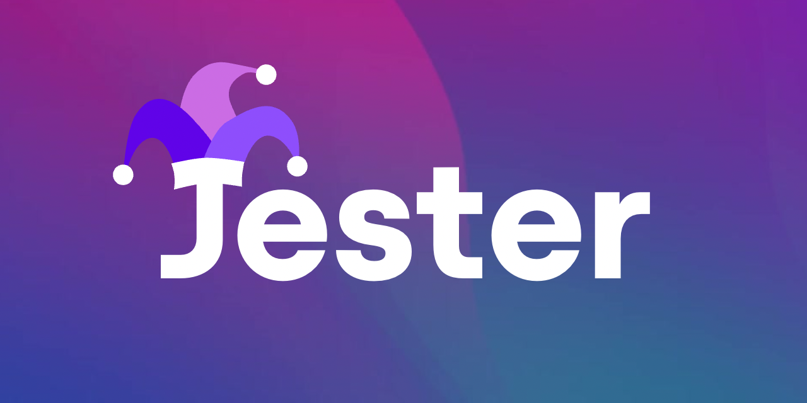
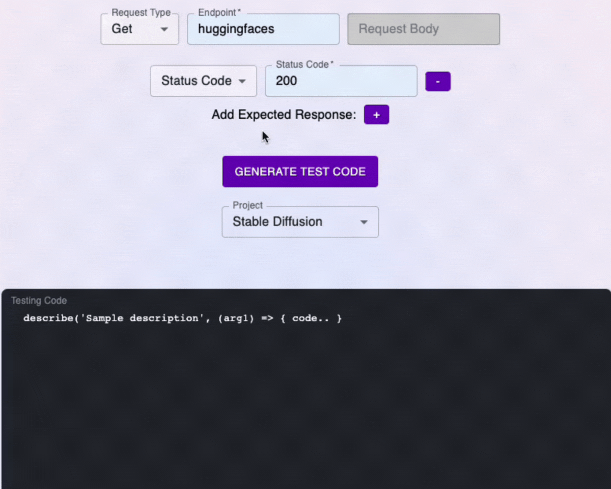

<h1 align="center">
  <a href="https://jester.software" target="_blank">
    
    </img>
  </a>
</h1>

<h3 align="center">Code Generator for Integration Tests</h3>

  
  
  

 

## Introduction
Welcome to **Jester**: An easy-to-use web application that helps you create and implement integration tests, to quickly build out a lightweight testing suite for your application.

## Getting Started
Please visit https://jester.software to get started. 

## Licenses
MIT

## How it Works
Jester will pass inputs from a Graphical User Interface to a server that will perform algorithmic logic to generate integration test code. From here, Jester can save your query into a database and feed back a functional test for your project if you want to take advantage of our account functionality, or it can simply return the functional test code without saving it to a database.

## Features

**Logging In**
You can use the application with limited functionality without creating an account and logging in; however, reccomend creating an account through GitHub oAuth for a secure and full experience.

**Creating a Test**
To create a test, begin by selecting the type of HTTP method you would like to write test code for as well as the endpoint of your request. To begin adding assertions, click the purple '+' icon and add up to three assertions as needed for any Status Code, Content Type, or Response Body. Once all relevant information has been input, click on 'Generate Test code' and Jester will generate a functional integration test.

**Creating a Project**
Logged in users are able to create a project inside of which generated test code snippets can be saved. You can generate test code using Jester and save it into a specific project utilizing the 'append to project' button.

  

This will help engineers stay organized while developing test suites for multiple projects.

**Viewing Your Saved Projects**
To view all of the projects you have created, please utilize our vertical tool bar on the left side of the page. When you select 'Projects', a pop-out menu will display all the projects on your account. From here, you can select any of your projects to view the saved code snippets inside. If you haven't created a project, please create one from here or generate test code and append it to a project in order to begin.

## Contributing
As an open source project, we are always open to contributors wanting to improve the library. 

## Contributors
<ul>
  <li>
    Anshuman Sinha
    
      
  </li>
  <li>
    Brian Hao
    
      
  </li>
  <li>
    Lilah August
    
      
  </li>
  <li>
    Michael Lam
    
      
  </li>
  <li>
    Serena Amos
    
      
  </li>
</ul>

## Documentation
The Jester docs are available at https://jester.software/documentation

## Resources
Built using React, Redux Toolkit, and Typescript