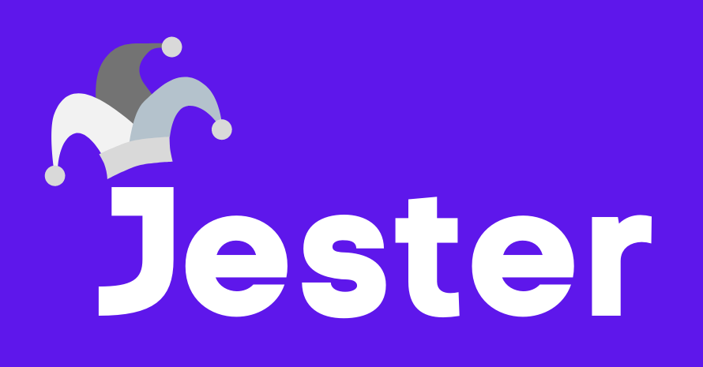

<h1 align="center" style="background-color: #5E17EB;">
  <a href="https://lapce.dev" target="_blank">
    
    </img>
  </a>
</h1>

<h3 align="center">Code Generator for Integration Tests</h3>

  
  
  

 

## Introduction

## Get Started

## Licenses

## Contributing
As an open source project, we are always open to contributors wanting to improve the library. For more information, please visit our [contributing documentation](https://github.com/oslabs-beta/d3no-data/blob/main/CONTRIBUTING.md). 

## Contributors
<ul>
  <li>
    Anshuman Sinha
    
      
  </li>
  <li>
    Brian Hao
    
      
  </li>
  <li>
    Lilah September
    
      
  </li>
  <li>
    Michael Lam
    
      
  </li>
  <li>
    Serena Amos
    
      
  </li>
</ul>